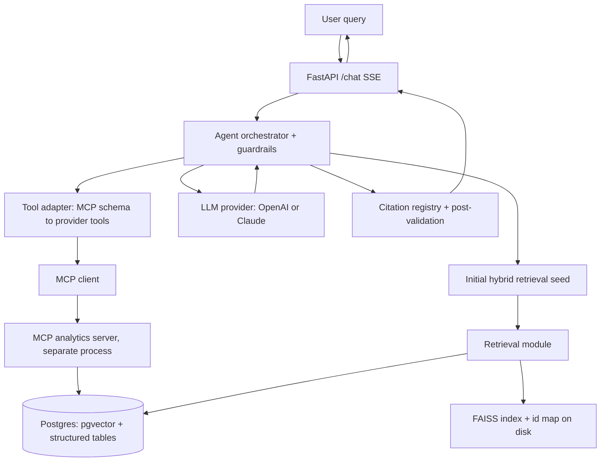

# grounded-ops-agent

> A grounded operations assistant that answers questions over a company's
> operational records by combining **retrieval** (the qualitative "why") with
> **live analytics tools over MCP** (the quantitative "how much" and "when"),
> and grounds every answer with **inline citations** back to source records,
> under hard agent guardrails.

[](https://github.com/Aditya20029/grounded-ops-agent/actions/workflows/ci.yml)
[](LICENSE)
[](pyproject.toml)

> **Status:** built in numbered phases; the app is runnable after every phase.
> See [Roadmap](#roadmap) for what is wired up so far.

<!-- TODO(demo): add demo.gif here once the frontend (Phase 10) lands. -->
<!--  -->

---

## What it does

The headline query it supports end to end:

> **"What was the average resolution time for P1 incidents last quarter, and what
> were the top 3 recurring root causes?"**

The agent computes the metric through an MCP analytics tool, retrieves the
relevant postmortems, returns a grounded answer with inline citations and a
sources list, and exposes a step-by-step tool-call trace.

## Architecture



Full design rationale: [docs/architecture.md](docs/architecture.md). The original
build specification: [docs/BUILD_PROMPT.md](docs/BUILD_PROMPT.md).

## Features

- **Hybrid retrieval** over pgvector (dense) + Postgres full-text (keyword), fused
  with Reciprocal Rank Fusion, with an optional cross-encoder reranker.
- **Two vector stores by design** — pgvector as the canonical, filterable,
  persistent source of truth; FAISS as a low-latency in-memory path and a
  benchmark baseline. The eval harness reports recall@k and p50/p95 latency for
  both. ([Why two stores?](#why-two-vector-stores))
- **MCP analytics tools** — a standalone read-only MCP server exposing
  `query_metrics`, `get_timeseries`, `aggregate`, `get_record`, `search_records`,
  and `list_schema`, with **identifier whitelisting** that closes the SQL
  identifier-injection vector.
- **Agentic loop with hard guardrails** — max steps, cycle detection, a
  per-request token budget, tool timeouts, retries, and read-only tools.
  ([How guardrails work](#how-guardrails-work))
- **Citation grounding** — a per-request citation registry with stable indices, a
  `sources` array on every answer, post-validation that strips hallucinated
  citations, and a faithfulness check.
- **Provider-agnostic** — Anthropic Claude or OpenAI behind one `LLMProvider`;
  sentence-transformers or OpenAI behind one `EmbeddingProvider`. Model names and
  prices live in config, never in code.
- **Reproducible evaluation** — seeded synthetic data, a gold set, and a metrics
  table (retrieval, citation, faithfulness, latency, cost).
- **Production hygiene** — Pydantic v2 models, async handlers, structured JSON
  logging with request ids, retry/backoff on every external call, no secrets in
  the repo, and CI that runs with no API keys.

## Quickstart

Prerequisites: Docker (for Postgres+pgvector), Python 3.11+, and optionally
`make`. From a clean clone:

```bash
make install     # editable install with dev extras
make up          # start Postgres+pgvector, wait until healthy
make migrate     # apply database migrations
make seed        # generate the synthetic corpus + load structured tables
make ingest      # chunk, embed, upsert into pgvector, build FAISS
make run         # serve the FastAPI app on http://127.0.0.1:8000
make mcp         # (separate terminal) run the MCP analytics server
make smoke       # end-to-end smoke test of the headline query
```

No API keys are needed to develop or to run the test suite: the default
embedding model (`BAAI/bge-small-en-v1.5`) runs locally on CPU, and tests use
deterministic offline fakes. An LLM provider key is required only to actually
generate answers; copy `.env.example` to `.env` and fill it in.

> **Windows without `make`:** every target maps to a single command shown in the
> [Makefile](Makefile); run those directly (e.g. `docker compose up -d --wait`,
> `python -m alembic upgrade head`, `python scripts/seed_db.py`, ...).

## Example queries

<!-- Sample outputs below illustrate the response shape; they will be replaced
     with captured runs once the agent loop (Phase 7) and API (Phase 8) land. -->

1. **"What was the average resolution time for P1 incidents last quarter, and what
   were the top 3 recurring root causes?"** — computes the metric via the
   `query_metrics` / `aggregate` MCP tools, retrieves the relevant postmortems,
   and returns a grounded answer with `[n]` citations plus a `sources` list and a
   tool-call trace.
2. **"Show the weekly trend of P1 incidents for the `payments` service this
   year."** — uses `get_timeseries`, grounded against the incident records.
3. **"Why did the checkout outage on the payments service happen, and how was it
   remediated?"** — retrieval-only, grounded against the postmortem with inline
   citations.
4. **"Which customers are on an enterprise SLA and had a P1 in the last 30 days?"**
   — hybrid SQL + vector retrieval with structured filters.

## Evaluation

`make eval` runs the harness over the gold set and prints a Markdown table of
retrieval metrics (recall@k, nDCG@k, MRR), citation precision/recall,
faithfulness, p50/p95 latency, and average cost per query. Numbers are produced
reproducibly (seeded data, pinned judge model) and recorded here with the models
and date used.

> _Eval numbers are added in Phase 9. Placeholder:_

| Metric | Value |
| --- | --- |
| recall@5 | _tbd_ |
| nDCG@5 | _tbd_ |
| MRR | _tbd_ |
| Citation precision / recall | _tbd_ |
| Faithfulness (3-pt rubric) | _tbd_ |
| p50 / p95 latency | _tbd_ |
| Avg cost / query | _tbd_ |
| FAISS vs pgvector (recall@5, p50/p95) | _tbd_ |

_Models and date: filled in with the results._

## Why two vector stores

pgvector is the **canonical** store: it lives in the same Postgres as the
structured operational data, enabling hybrid SQL + vector queries (semantic
search filtered by `priority`/`status`/`service`/`created_at`, joined to
structured tables), with cosine distance, an HNSW index, transactional
consistency, and persistence. FAISS is a **derived** in-memory index for a
low-latency semantic path and as a benchmark baseline (Flat/IVF/HNSW) for recall
and latency. FAISS stores vectors only, so a `faiss-id -> chunk_id` mapping is
persisted alongside it and rebuilt from pgvector if missing or stale. The eval
benchmark comparing the two is the reason both exist.

## How guardrails work

One guaranteed initial hybrid retrieval seeds context; then a bounded loop lets
the model call tools via native tool-calling and finally answer. Bounds:
`MAX_AGENT_STEPS` (hard stop), cycle detection on hashed `(tool, args)`, a
`PER_REQUEST_TOKEN_BUDGET` enforced by pre-step estimation and reconciled against
actual usage, `TOOL_TIMEOUT_SECONDS` + `MAX_TOOL_RETRIES`, per-request cost
accounting, and a structured tool-call trace. Retrieved content and tool output
are treated as untrusted **data** (delimited, never executed as instructions).

## Tech stack

Python 3.11+ · FastAPI + uvicorn · Pydantic v2 + pydantic-settings ·
PostgreSQL + pgvector · SQLAlchemy 2 (async) + asyncpg + Alembic · faiss-cpu ·
sentence-transformers · Anthropic + OpenAI SDKs · MCP Python SDK · pytest /
ruff / mypy · Docker Compose · GitHub Actions.

## Configuration

All configuration is environment-driven and validated at startup
(fail-fast). See [.env.example](.env.example) for every variable with a comment.
At least one LLM provider key is required; the OpenAI embedding option requires
its key. Prices in [config/pricing.json](config/pricing.json) are configurable
and may be out of date.

## Development

```bash
make lint        # ruff check + format check
make typecheck   # mypy (strict-ish)
make test        # full suite
make test-unit   # offline unit tests (no DB, no keys)
make test-integration  # needs Postgres+pgvector
```

CI runs lint, type check, unit tests, then migrations + integration tests against
a pgvector service — with no provider API keys (providers are faked in tests).

## Roadmap

- [x] **Phase 0/1** — repo, tooling, docker-compose, CI, README skeleton.
- [ ] **Phase 2** — data model, migrations, seeded synthetic dataset.
- [ ] **Phase 3** — embeddings + idempotent ingestion.
- [ ] **Phase 4** — vector stores, hybrid retrieval, FAISS-vs-pgvector benchmark.
- [ ] **Phase 5** — generation + citation grounding.
- [ ] **Phase 6** — MCP analytics server + client + tool adapter.
- [ ] **Phase 7** — agent orchestrator + guardrails.
- [ ] **Phase 8** — FastAPI surface + SSE protocol.
- [ ] **Phase 9** — evaluation harness with real numbers.
- [ ] **Phase 10** — minimal frontend, demo GIF, deploy notes.

## License

[MIT](LICENSE).
