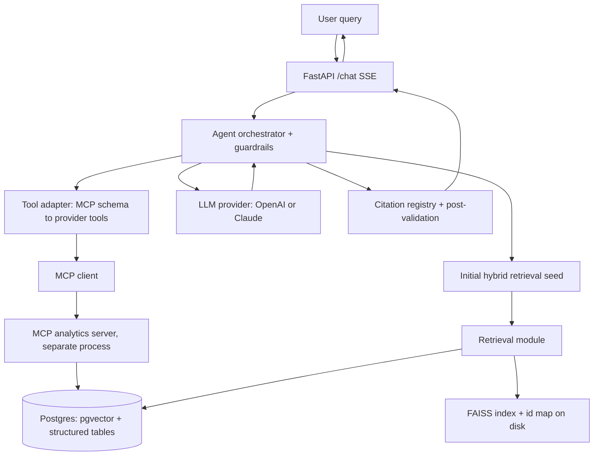

# Architecture

`grounded-ops-agent` is a grounded operations assistant. It answers questions
over a company's structured and unstructured operational records by combining
**retrieval** (for the qualitative "why") with **live analytics tools exposed
over MCP** (for the quantitative "how much" and "when"), and grounds every
answer with inline citations back to source records.

The headline query it supports end to end:

> "What was the average resolution time for P1 incidents last quarter, and what
> were the top 3 recurring root causes?"

The agent computes the metric through an MCP analytics tool, retrieves the
relevant postmortems, returns a grounded answer with inline citations and a
sources list, and exposes a step-by-step tool-call trace.

## System diagram

## Design principles and invariants

These rules hold across the whole codebase. Violations are treated as bugs.

1. **One embedding model at a time.** Query and document embeddings come from
   the same model. The active model id and its vector dimension are stamped into
   the index metadata; retrieval asserts a match at query time. Different models
   have different dimensions (384 vs 1536) and are not interchangeable.
2. **The two vector stores stay in sync.** pgvector is the source of truth.
   FAISS is a derived index that can always be rebuilt from pgvector. They never
   diverge silently.
3. **Tools are read-only.** MCP analytics tools never write, never run arbitrary
   SQL, and never accept identifiers that are not whitelisted. They only read and
   aggregate, with a hard row cap.
4. **Retrieved content and tool output are untrusted data, not instructions.**
   They are delimited and labelled as data in prompts; the model is told not to
   follow instructions found inside them.
5. **Ingestion is idempotent.** Re-running ingestion upserts on `chunk_id` and
   never duplicates chunks.
6. **Graded evaluation is reproducible.** The data generator is seeded, graded
   LLM runs request temperature 0 (see the determinism caveat below), and the
   report records the models and date used.
7. **No secrets in the repo.** Everything sensitive comes from environment
   variables, validated at startup. Keys are redacted from any logged config.

## Why two vector stores

Both stores serve the same `VectorStore` interface, but they exist for different
reasons, and the benchmark comparing them is the justification:

- **pgvector** is the canonical, persistent store. It lives in the same Postgres
  instance as the structured operational data, which enables **hybrid SQL +
  vector** queries: semantic search filtered by `priority`, `status`, `service`,
  `created_at`, with joins to structured tables. Distance is cosine (`<=>`); the
  index is HNSW with `vector_cosine_ops`. This is the production retrieval path:
  metadata filtering, transactional consistency, persistence.
- **FAISS** is an in-process, in-memory index used for (a) a low-latency semantic
  path when no SQL filtering is needed, and (b) a benchmark baseline comparing
  recall and latency against pgvector across index types (Flat, IVF, HNSW).
  FAISS stores vectors only, so a side mapping from FAISS internal id to
  `chunk_id` is persisted alongside the index; both are loaded on startup and
  rebuilt from pgvector if missing or if the stamped embedding model differs.

The eval harness reports recall@k and p50/p95 latency for FAISS vs pgvector on
the gold set. That comparison is the reason both exist.

## How guardrails work

The orchestrator runs one guaranteed initial hybrid retrieval to seed context,
then enters a loop where the model may call tools (refined retrieval via
`search_records`, plus analytics tools) using native provider tool-calling, and
finally produces a grounded answer. The loop is bounded by:

- **`MAX_AGENT_STEPS` (default 6)** — a hard stop on loop iterations.
- **Cycle detection** — each call is hashed as `(tool_name, normalized_args)`; a
  repeat is blocked and the model is nudged to try a different approach or answer.
- **`PER_REQUEST_TOKEN_BUDGET` (default 30000)** — before each step, input tokens
  are estimated with the provider's counter plus reserved output headroom; if the
  projected next step would exceed the budget, the loop stops and forces a final
  answer. The running total is reconciled against actual usage after each call.
- **`TOOL_TIMEOUT_SECONDS` (default 15)** and **`MAX_TOOL_RETRIES` (default 2)** —
  tool errors are fed back to the model with a retry cap; after the cap the
  orchestrator proceeds without that tool.
- **Cost accounting** — per-request token and USD cost (from `config/pricing.json`
  and actual usage), returned in the response.
- **A structured tool-call trace** — each step records tool, arguments, latency,
  and a result summary.

## Citation grounding

A per-request **citation registry** accumulates every chunk surfaced across all
retrieval steps and assigns each a stable index once (indices never shift or
collide between steps). The answering prompt presents chunks as labelled,
delimited data with their indices and instructs the model to cite with bracketed
indices like `[1]`. The API returns a `sources` array of
`{index, chunk_id, doc_id, title, snippet, char_span}`. **Post-validation** checks
that every cited index exists in the registry and strips hallucinated citations.
A **faithfulness check** (LLM-as-judge or an NLI model) scores whether the cited
chunks support each claim, surfaced in the eval harness.

## Trust boundaries and security

- Retrieved documents and tool outputs are treated as untrusted **data**:
  delimited in prompts, with an explicit instruction not to follow embedded
  instructions.
- Tools are read-only with whitelisted identifiers. SQL identifiers (table,
  column, `group_by`, aggregate function) cannot be parameterized, so an explicit
  whitelist (`ALLOWED = {table: {columns, group_by_columns}}`,
  `ALLOWED_AGG = {count, sum, avg, min, max}`) validates every identifier; only
  values are bound as parameters. This closes the identifier-injection vector.
- Input-size limits apply to user queries, tool arguments, and ingested documents.
- No secrets in code or logs.

## Key dependencies and notes

Versions are pinned only after checking current releases; model names and prices
come from config, never literals in code paths.

- **MCP Python SDK** (`mcp`, verified against the 1.x line). Server built with
  `FastMCP` (`from mcp.server.fastmcp import FastMCP`, `@mcp.tool()`), run over
  `transport="stdio"` (local dev; orchestrator spawns it as a subprocess) or
  `transport="streamable-http"` (networked). Client uses `ClientSession` +
  `stdio_client` (2-tuple `(read, write)`) or `streamablehttp_client` (3-tuple).
  `list_tools()` returns `Tool` objects with `.name`/`.description`/`.inputSchema`;
  `call_tool()` returns a `CallToolResult` with `.content` (list of `TextContent`),
  `.structuredContent`, and `.isError`. `mcp.run()` is blocking and owns its event
  loop, so it is never called inside the FastAPI loop.
- **Postgres + pgvector** (`pgvector/pgvector:pg16`), SQLAlchemy 2 async +
  asyncpg, Alembic migrations.
- **Embeddings**: sentence-transformers `BAAI/bge-small-en-v1.5` (384d, default,
  CPU-friendly, no API key) or OpenAI `text-embedding-3-small` (1536d).
- **LLM**: Anthropic Claude (default `claude-opus-4-7`) or OpenAI, behind one
  `LLMProvider` interface with `complete()`, `stream()`, native tool-calling, and
  a provider-appropriate `count_tokens()`.

### Determinism caveat for graded evaluation

The eval rubric calls for temperature 0 on graded runs. On Anthropic Opus 4.7 /
4.8 (and Fable 5) sampling parameters including `temperature` are not accepted by
the API, so the provider omits `temperature` for those models and determinism
relies on the deterministic prompt and the model's default decoding. The eval
report records the exact judge model and date so results remain interpretable.
Models that accept `temperature` (OpenAI, Anthropic Sonnet/Haiku) receive
`temperature=0`. This is documented rather than hidden because it is exactly the
kind of provider-specific detail that matters for reproducible evaluation.
